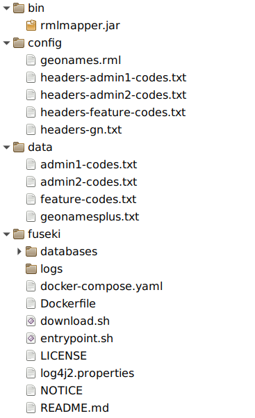

# GeoNames RDF

This repository contains shell scripts that download [GeoNames data dumps](https://download.geonames.org/export/dump/)
and convert them to RDF using [SPARQL Anything](https://github.com/SPARQL-Anything/sparql.anything),
resulting in a `geonames.ttl` file that you can load into a SPARQL server.

## Running

You can run the transform process in a Docker container or directly on your host machine.

### In Docker

To run the transform process in a Docker container, run:

```shell
docker run -v $(pwd)/output:/output --rm ghcr.io/netwerk-digitaal-erfgoed/geonames-rdf
```

### Directly

To run the scripts directly, run:

```shell
./download.sh
```

Then start the mapping process with:

```shell
./map.sh
```

This will download SPARQL Anything if not already available.

## Output

After running the transform process, you’ll find a `output/geonames.ttl` file 
that you can load into a SPARQL server. 

### Fuseki

The Geonames RDF is exposed through a Jena Fuseki based SPARQL endpoint. In this setup is choosen for the Fuseki docker server without UI. Download and extract the latest version of [the Jena Fuseki Docker](https://repo1.maven.org/maven2/org/apache/jena/jena-fuseki-docker/) zipfile and rename the new directory to `./fuseki`. Build the docker image using `docker-compose build --build-arg JENA_VERSION={latest version}`. Be sure to use a recent docker-compose version! Create an empty 'databases' and 'logs' dir before the first run. See the [Fuseki docs](https://jena.apache.org/documentation/fuseki2/fuseki-docker.html) for more information.

Afther cloning the repo and installing the additional tools described above, the subdirectories will look like this:


